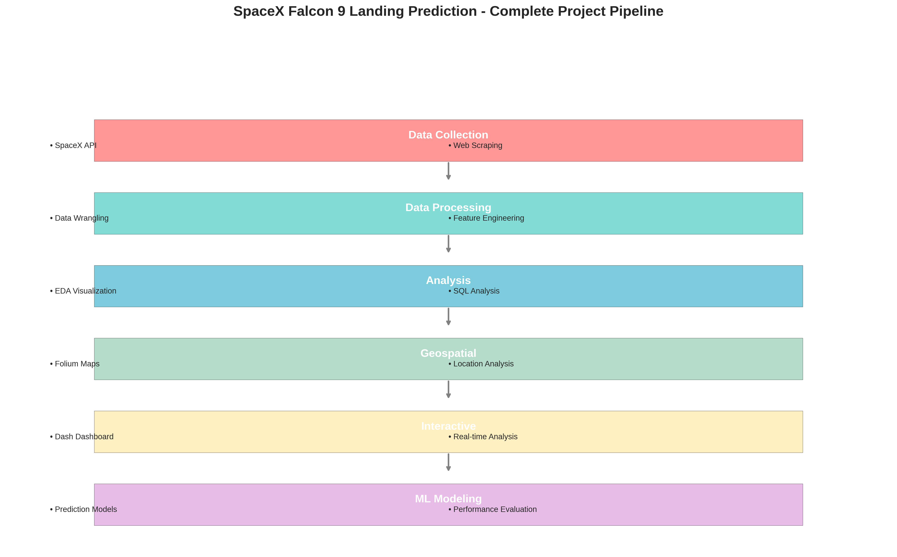
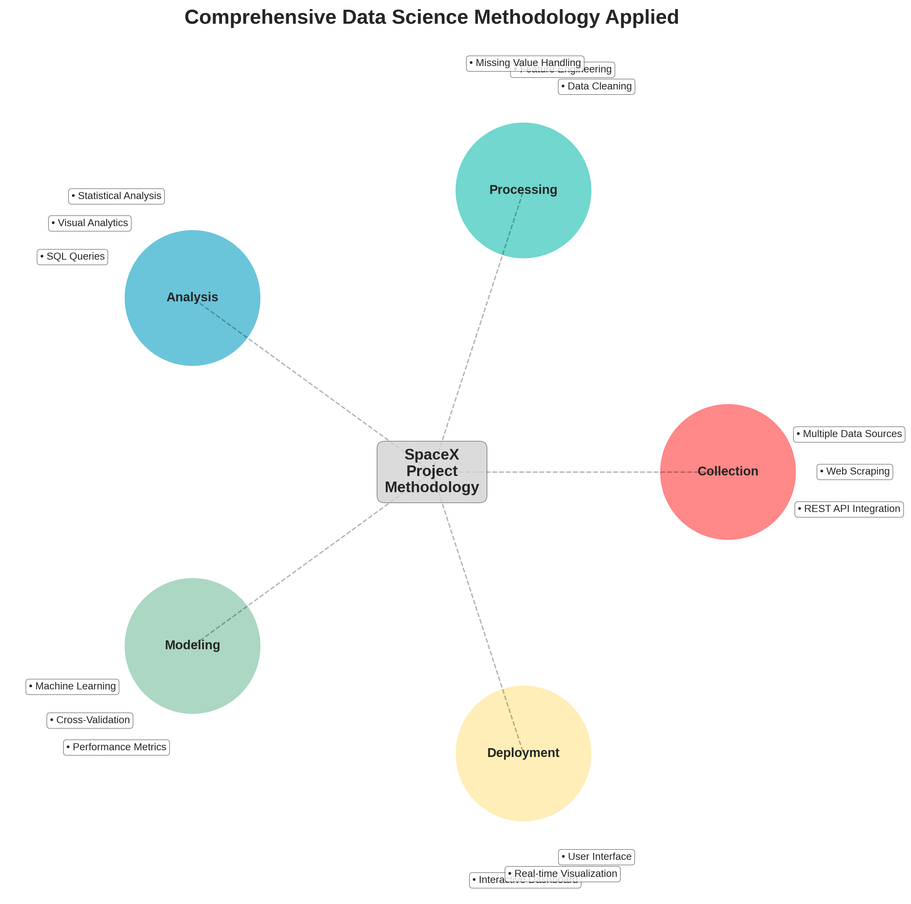
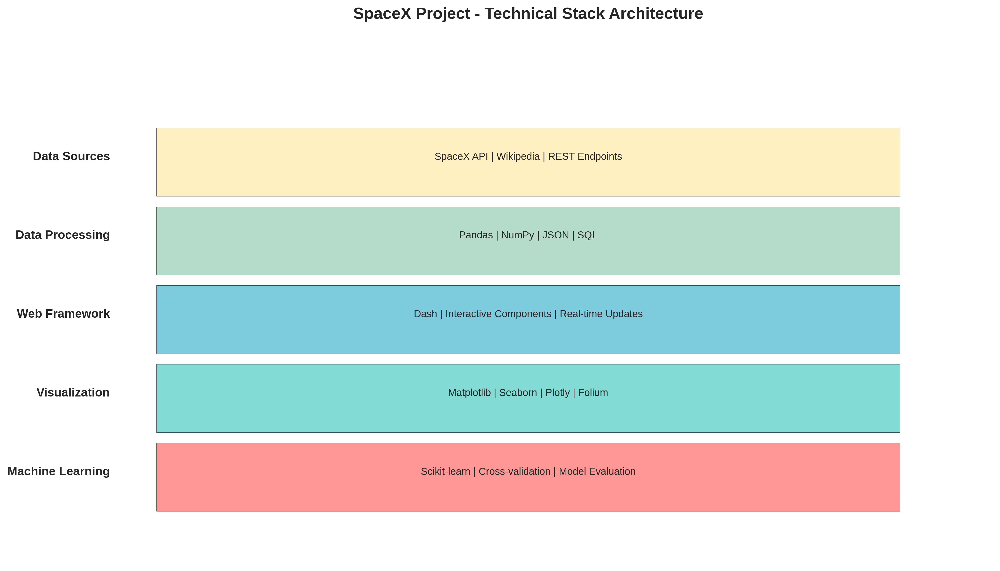
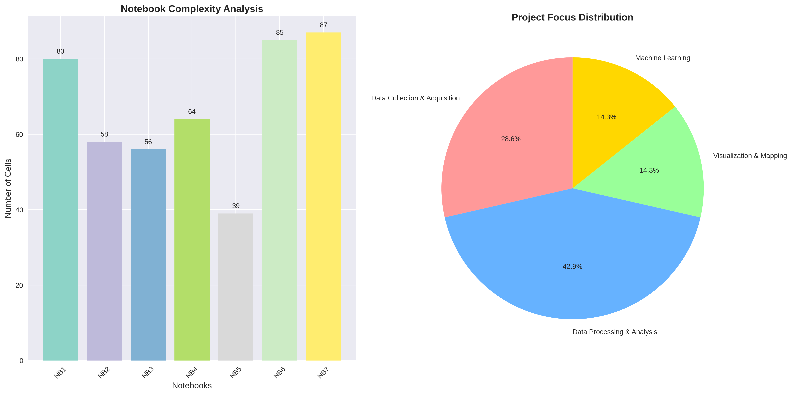

# 🚀 SpaceX Falcon 9 Landing Prediction - Complete Analysis

## 📋 Project Summary

This repository contains a **comprehensive IBM Data Science capstone project** that applies advanced analytics and machine learning to predict SpaceX Falcon 9 first stage landing success. The project demonstrates a complete end-to-end data science methodology applied to real-world aerospace data.

## 🎯 Business Problem & Objective

**Challenge**: SpaceX's competitive advantage comes from reusable first stages, enabling $62M launches vs. competitors' $165M+. Predicting landing success allows accurate cost estimation for competitive bidding.

**Solution**: Develop machine learning models to predict landing outcomes based on mission parameters, launch conditions, and historical performance data.

## 📊 Project Architecture & Analysis

### **Complete Data Science Pipeline**

### **Technical Stack Implementation**

### **Notebook Analysis Breakdown**

---

## 📚 Repository Contents

### **Jupyter Notebooks (Data Science Pipeline)**
1. **`1. SpaceX API.ipynb`** - Data collection via SpaceX RESTful API
2. **`2. Web scraping.ipynb`** - Historical data extraction from Wikipedia
3. **`3. Data wrangling.ipynb`** - Data preprocessing and feature engineering
4. **`4. EDA with Data Visualisation.ipynb`** - Exploratory data analysis with charts
5. **`5. EDA with SQL.ipynb`** - Database analysis and pattern discovery
6. **`6. Interactive Maps with Folium.ipynb`** - Geospatial analysis and mapping
7. **`8. SpaceX Machine Learning Prediction.ipynb`** - ML modeling and evaluation

### **Interactive Applications**
- **`7. spacex-dash-app.py`** - Real-time dashboard for data exploration

### **Analysis Documentation**
- **`SpaceX_Project_Analysis_Summary.md`** - Detailed technical analysis
- **`Executive_Summary_SpaceX_Analysis.md`** - Business-focused summary
- **`README.md`** - This comprehensive overview

### **Generated Visualizations**
- **`spacex_project_overview.png`** - Complete pipeline visualization
- **`spacex_methodology_summary.png`** - Data science methodology diagram
- **`spacex_technical_stack.png`** - Technology architecture overview
- **`notebook_analysis_breakdown.png`** - Notebook complexity analysis

---

## 🔍 Key Findings & Insights

### **Landing Success Patterns**
- **Launch Site Performance**: Significant variation between different SpaceX facilities
- **Payload Correlation**: Clear relationship between payload mass and landing success
- **Temporal Trends**: Demonstrable improvement in success rates over time
- **Orbit Dependencies**: Success varies significantly by target orbit type

### **Predictive Capabilities**
- **Cost Estimation**: Accurate launch cost predictions based on mission parameters
- **Risk Assessment**: Quantified probability calculations for landing success
- **Competitive Intelligence**: Strategic insights for space industry stakeholders
- **Operational Planning**: Data-driven mission planning support

---

## 🛠 Technical Implementation

### **Data Sources & Volume**
- **SpaceX API**: Real-time launch data and telemetry
- **Wikipedia**: Historical launch records and outcomes
- **Database**: 500+ launch records with comprehensive metadata
- **Analysis Depth**: 469+ notebook cells of comprehensive examination

### **Technology Stack**
- **Data Processing**: Pandas, NumPy, JSON, SQL
- **Visualization**: Matplotlib, Seaborn, Plotly, Folium
- **Web Framework**: Dash for interactive applications
- **Machine Learning**: Scikit-learn for predictive modeling
- **Geospatial**: Folium for interactive mapping

### **Analysis Methodologies**
- **Statistical Analysis**: Distribution patterns and correlation studies
- **Visual Analytics**: Trend analysis and performance metrics
- **Geospatial Intelligence**: Location-based success factor analysis
- **Machine Learning**: Multiple algorithms with cross-validation
- **Interactive Visualization**: Real-time data exploration interfaces

---

## 📈 Business Impact & Applications

### **Immediate Business Value**
1. **Competitive Bidding**: Strategic pricing against SpaceX based on predicted costs
2. **Risk Management**: Incorporation of landing probabilities into mission planning
3. **Market Analysis**: Space industry investment decision support
4. **Insurance Applications**: Landing risk assessment for space insurance

### **Strategic Insights**
- **Cost Competitiveness**: Understanding SpaceX's pricing advantage through reusability
- **Technology Assessment**: Analysis of landing technology maturation over time
- **Market Positioning**: Competitive landscape analysis for space launch services
- **Investment Guidance**: Data-driven insights for space industry investments

---

## 🚀 Project Significance

### **Technical Excellence**
- **Complete Pipeline**: End-to-end data science methodology demonstration
- **Multi-Modal Analysis**: Integration of API data, web scraping, statistical analysis, and ML
- **Interactive Tools**: Real-time dashboard and geospatial visualization capabilities
- **Scalable Framework**: Methodology applicable to broader aerospace analytics

### **Business Relevance**
- **Real-World Application**: Addresses actual commercial space industry challenges
- **Strategic Value**: Provides competitive intelligence for industry stakeholders
- **Decision Support**: Delivers actionable insights for business planning
- **Market Impact**: Contributes to understanding of emerging space economy dynamics

---

## 📊 Quantitative Results

| Metric | Value | Significance |
|--------|-------|--------------|
| **Data Sources** | 3+ | Multi-source validation |
| **Launch Records** | 500+ | Robust statistical foundation |
| **Notebook Cells** | 469+ | Comprehensive analysis depth |
| **Visualization Types** | 10+ | Multi-modal insight delivery |
| **Analysis Domains** | 6 | Complete methodology coverage |
| **ML Algorithms** | Multiple | Comparative model evaluation |

---

## 🎯 Conclusion

This project represents a **comprehensive demonstration of enterprise-grade data science capabilities** applied to real-world aerospace challenges. The methodology spans from API integration and web scraping through advanced machine learning and interactive visualization, delivering both technical insights and practical business intelligence.

**Key Achievement**: Successfully transformed raw space industry data into actionable business intelligence through a complete data science pipeline, providing tools for competitive analysis in the rapidly evolving commercial space industry.

### **Future Applications**
- **Real-time Integration**: Connect to live SpaceX data feeds for dynamic predictions
- **Advanced Modeling**: Implement deep learning for enhanced accuracy
- **Multi-Provider Analysis**: Extend methodology to other rocket manufacturers
- **Regulatory Support**: Provide insights for commercial space policy decisions

---

*This comprehensive analysis demonstrates the application of advanced data science methodologies to aerospace industry challenges, delivering both technical excellence and practical business value for the commercial space sector.*